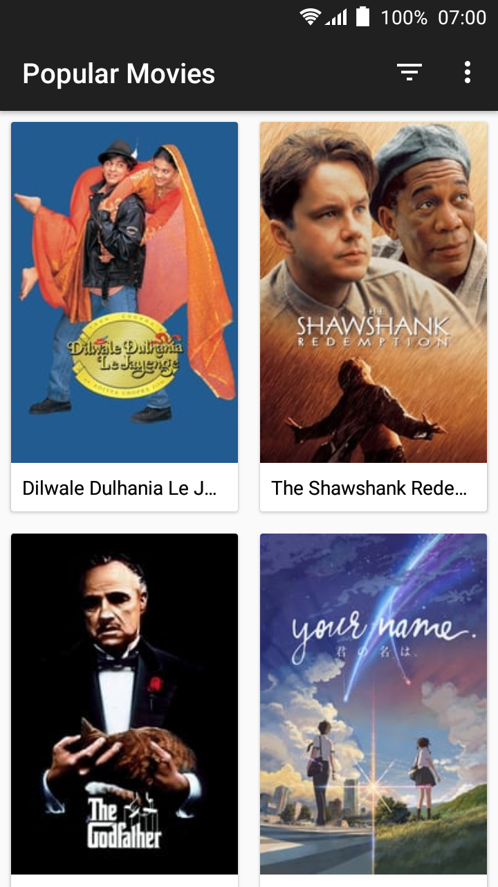

# Popular Movies App

## Project Overview
App allows users discover the most popular and top rated movies playing. Movies are gotten from themoviedb.org API.

## Getting Started

The app uses the Gradle build system. To build this project, use the
"gradlew build" command or use "Import Project" in Android Studio.

You will need an API key from themoviedb.org to request data. If you don’t already have an account, you will need to [create one](https://www.google.com/url?q=https://www.themoviedb.org/account/signup&sa=D&ust=1533333489625000) in order to
                                                                           request an API Key.
Use your API key as the value for API_KEY in the file popularmovies/data/network/MovieNetworkDataSource.java.

## Prerequisites

- Android SDK v27
- Android Build Tools v27.0.3
- Android Support Repository v27.1.1
- Gradle 3.1.4

## Author

Zizoh Anto

## License

This project is licensed under the Apache License 2.0 - See: http://www.apache.org/licenses/LICENSE-2.0.txt

## Screenshot
 